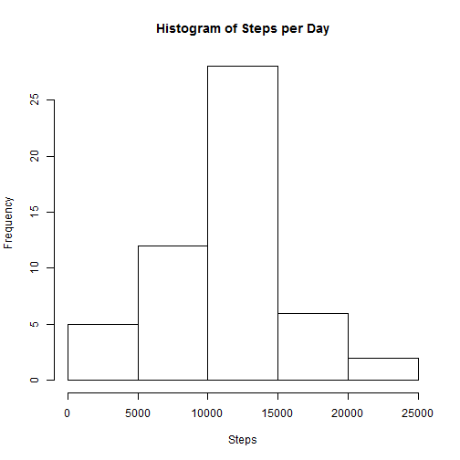
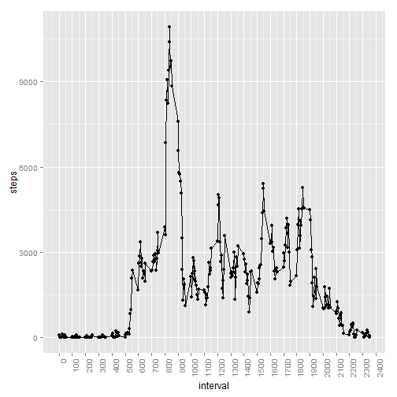
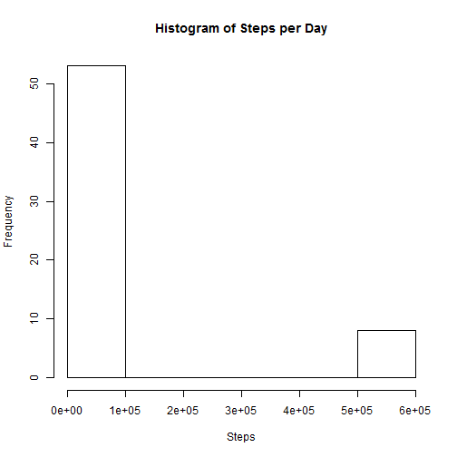
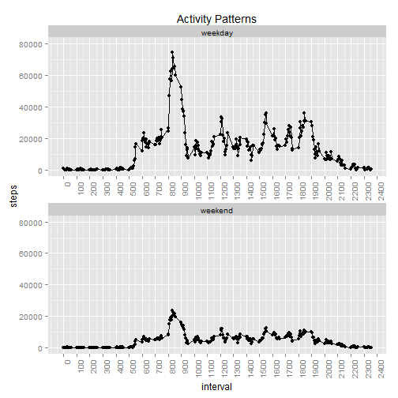

## Loading and preprocessing the data

```r
# Install Packages
library(dplyr)
library(ggplot2)

# Download the ActivityMonitoringZip file.
sourceFile <- "http://d396qusza40orc.cloudfront.net/repdata%2Fdata%2Factivity.zip"
destFile <- "ActivityMonitoringSource.zip"
download.file(url = sourceFile, destfile = destFile)

# Unzip the Activity.csv file.
unzip("ActivityMonitoringSource.zip")

#Load the activity csv.
activityRaw <-  read.table(file = "activity.csv",header = TRUE, stringsAsFactors = FALSE ,sep = ",")
```

## What is mean total number of steps taken per day?

```r
# Remove missing Values.
activityNoNA <- na.omit(activityRaw) 

# USe dplyr to group by date.
activity <- tbl_df(data = activityNoNA)
by_date <- group_by(.data = activity, date)
stepsPerDay <- summarize(by_date, steps = sum(steps))

# Create Histogram
hist(x = stepsPerDay$steps, main = "Histogram of Steps per Day",xlab = "Steps")
```

 

```r
# Calculate the mean and median of the steps.
meanSteps = as.integer(mean(x = stepsPerDay$steps))
medianSteps = as.integer(median(x = stepsPerDay$steps))
```
**Mean and Median of Steps per Day**  
Mean steps: 10766  
Median steps: 10765  

## What is the average daily activity pattern?

```r
# Use dplyr to group by interval.
activity <- tbl_df(data = activityNoNA)
by_interval <- group_by(.data = activity, interval)
avgStepsPerInterval <- summarize(by_interval, steps = sum(steps))

# GGPlot
lp <- ggplot(data=avgStepsPerInterval,
             aes(x=interval, y=steps)) +
  geom_line() + geom_point() +
  scale_x_continuous(breaks=pretty(avgStepsPerInterval$interval, n=24)) + # Change X Axiz breaks.
  theme(axis.text.x = element_text(angle = 90, hjust = 1)) # Rotate X Axis text.

lp
```

 

```r
#Determine which interval has the highest average steps.
maxStepInterval <- avgStepsPerInterval$interval[which(avgStepsPerInterval$steps == max(avgStepsPerInterval$steps))]
```
**Interval with greatest average steps**  
Interval: 835  

## Imputing missing values

```r
countofNA <- sum(is.na(activityRaw))
```
Total number of missing values (rows) is `r countofNA  


```r
# Create a new data set (data frame) to replace NA values.
activityReplaceNA <- activityRaw

# Replace the NA values with the average of the intervals.
for(i in 1:nrow(activityReplaceNA)) {
    #activityRaw2[i,]
    if(is.na(activityReplaceNA[i,1])) {
        activityReplaceNA[i,1] <- avgStepsPerInterval$steps[which(activityReplaceNA[i,3]== avgStepsPerInterval$interval )]

    }
}

# USe dplyr to group by date.
activity <- tbl_df(data = activityReplaceNA)
by_date <- group_by(.data = activity, date)
stepsPerDay <- summarize(by_date, steps = sum(steps))

# Create Histogram
hist(x = stepsPerDay$steps, main = "Histogram of Steps per Day",xlab = "Steps")
```

 

```r
# Calculate the mean and median of the steps.
meanSteps = as.integer(mean(x = stepsPerDay$steps))
medianSteps = as.integer(median(x = stepsPerDay$steps))
```
**Mean and Median of Steps per Day**  
Mean steps: 84188  
Median steps: 11458  

## Are there differences in activity patterns between weekdays and weekends?

```r
# Use dplyr to add the weekday field, group and summerize.
activity <- tbl_df(data = activityReplaceNA)
activityDayAdded <- mutate(.data = activity,day = ifelse (weekdays(as.Date(date, format="%Y-%m-%d")) %in% c("Saturday", "Sunday"), "weekend", "weekday")) %>%
    group_by(day, interval) %>%
    summarize(steps = sum(steps))


# Convert the day field to a factor.
activityDayAdded$day <- as.factor(activityDayAdded$day)

# Plot the Panel Graph
ggplot(data=activityDayAdded,
       aes(x=interval, y=steps)) +
    geom_line() + geom_point() +
    scale_x_continuous(breaks=pretty(avgStepsPerInterval$interval, n=24)) +
    expand_limits(y=c(0,80000)) +
    theme(axis.text.x = element_text(angle = 90, hjust = 1)) +
    ggtitle("Activity Patterns") +
    facet_wrap(~ day, scales = "free", ncol = 1)
```

 


